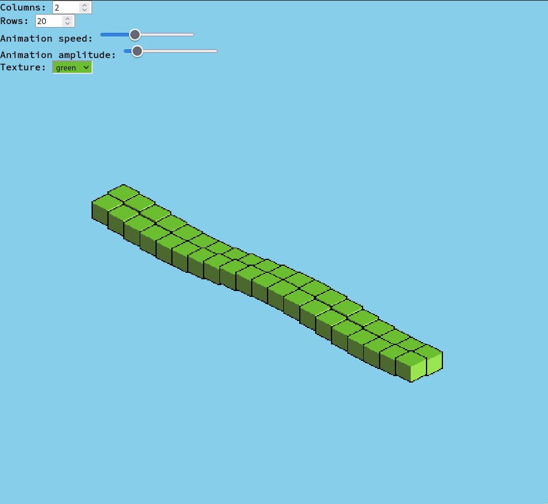
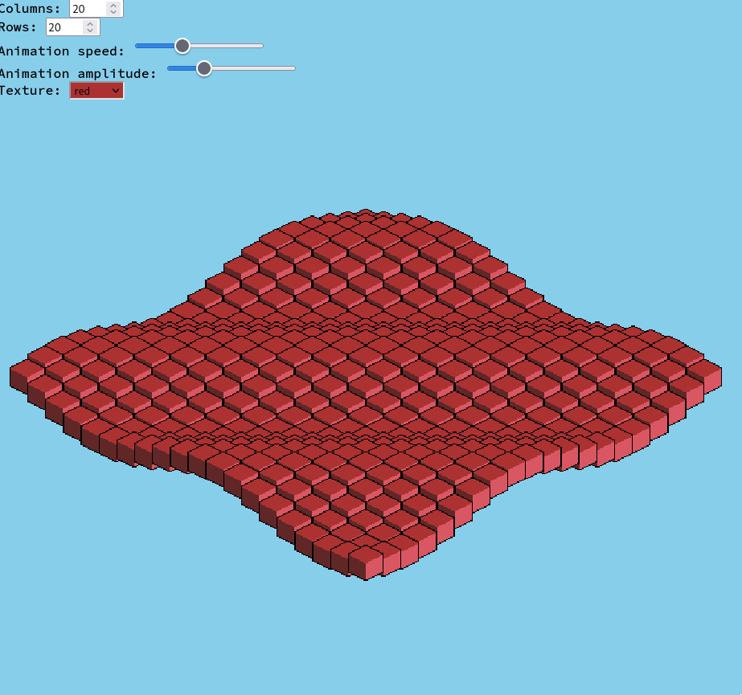

# Features

- Customizable amount of columns and rows
- Multiple textures to choose from
- Customizable animation

# To do

- Multiple animations

# Build

- Run `./build.sh`

## Requirements

- [minify](https://github.com/tdewolff/minify)
